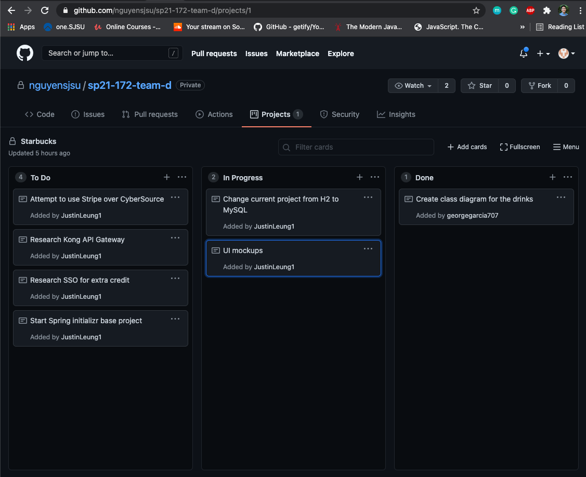
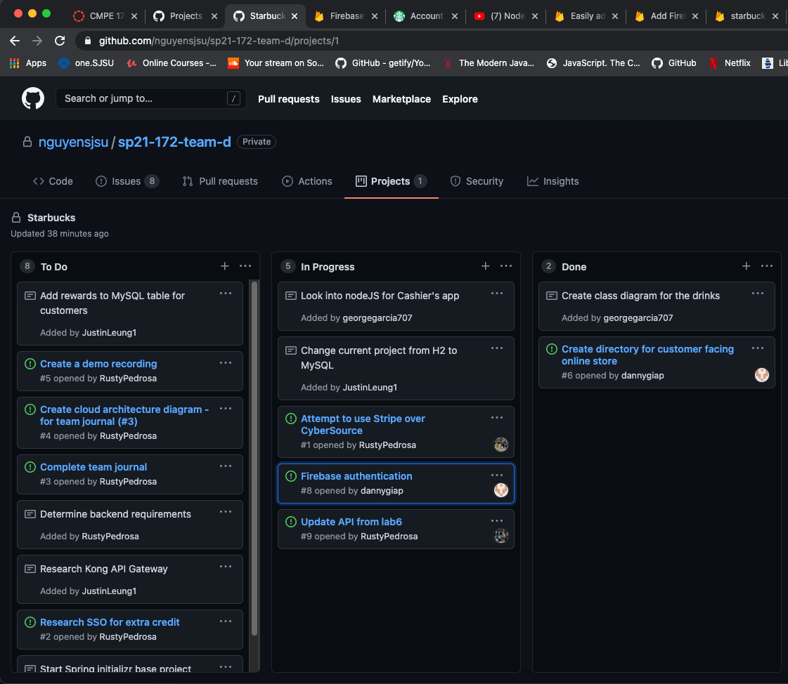
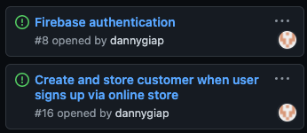
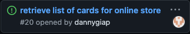

# CMPE 172 Project Journal

## Week 1

### Accomplishments

This was the first week that our team had a meeting. I volunteered to push my Starbucks API to the repository as the starting point for our project. I also have started thinking about the UI.

code commits:
https://github.com/nguyensjsu/sp21-172-team-d/commit/300813f0c18ca357bb6be188c4d2bdeca4b44541

### Challenges and Resolutions

The main challenge this week was understanding the requirements of the project. It usually takes me a bit of time to wrap my head around the many different aspects of an application I am about to build, and this project is heavy on the architectural/integration side of things. I plan to create a few UI mockups just to help us get started with our design.

## Week 2

### Accomplishments

This week I made progress on the customer facing online store. I set up the project and will be using node.js for routing and handlebars for rendering views. I started implementing authentication using firebase.

code commit:
https://github.com/nguyensjsu/sp21-172-team-d/commit/955f34ccb7dff8429c2c4d3d34bfb70ad7f639c6

### Challenges and Resolutions

The main challenge this week was deciding what stack to use to build the online store. I almost decided to use the react framework to build the frontend, but i decided to stick with vanilla javascript/html just so it is easier for teammates to collaborate and not spend time learning an entirely new framework. I also spent time thinking about how authentication would be handled and I came across firebase. The integration is going smoothly so far, and there is good documentation.

## Week 3

### Accomplishments

This week I was able to get Firebase authentication to work. When a user first signs up for an account on the online store, the Starbucks API is called and will create a new customer object to store into a database.

code commit:
https://github.com/nguyensjsu/sp21-172-team-d/commit/3f89bd026402f9c467df59a18f445685c08811c6

### Challenges and Resolutions

The main challenge was getting the online store to successfully make API calls to the Starbucks API. During testing, I had issues with CORS, and i had to make some tweaks to the API code to accept requests from the online store. I also had to refresh my memory on how request bodies were being mapped to a java object.
Another challenge was realizing that the view templating engine i was using (EJS) could not load in javascript files that existed in a different directory. Because of this, I am no longer using EJS to render views, and instead will serve pure HTML to the user.

## Week 4

### Accomplishments

This week I worked on the online-store and modified the starbucks api to work with api calls that come from the online store. The main accomplishment was making requests and passing in necessary data to retrieve a customer's cards and display them to the user. I also added some more routes for the online store express server.

code commits:
https://github.com/nguyensjsu/sp21-172-team-d/commit/26ca56f48c145d2c4df57fbb5eb20fea216182bc
https://github.com/nguyensjsu/sp21-172-team-d/commit/520a46ee0aecc6ae01af8d1835c22fb1c4b9ac4c

### Challenges and Resolutions

The challenge this week was to successfully request data from the starbucks API. After new customer endpoints were created for the starbucks API by my groupmate, I then had to make sure that the online store is able to make requests to these endpoints and get the necessary data as a response. It took some testing and code adjustments to make debug the errors I was getting from these requests. I also had to brush up my skills on DOM manipulation in order to render the data that was received from the API.
