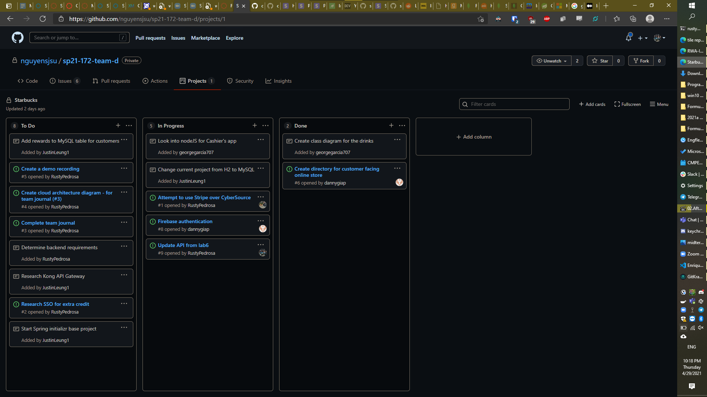

# CMPE 172 Project Journal - Rusty Pedrosa (Enrique)

## Week 2
- Started investigating Stripe as an alternative to CyberSource
  - Issue #1
  - Created an account at Stripe.  Looks like it will be similar to lab 7.
  - https://github.com/nguyensjsu/sp21-172-team-d/commit/f4b206bac10336f74abc280c45a545775cba40b6
- Reassigned stripe (issue #1) to Justin

- Created issue #2 for tracking SSO research
  - auth0
  - okta
  - firebase
  - onelogin
- Added tickets for the rest of the project requirements
- Started comparing API differences vs my lab6 submission

https://github.com/nguyensjsu/sp21-172-team-d/commit/f4b206bac10336f74abc280c45a545775cba40b6

## Week 1
- Missed our first group meeting due to a midterm timing conflict. Team brought me up to speed in group chat.
- Team already has laid out the first few tasks, so I will be getting started next week.
