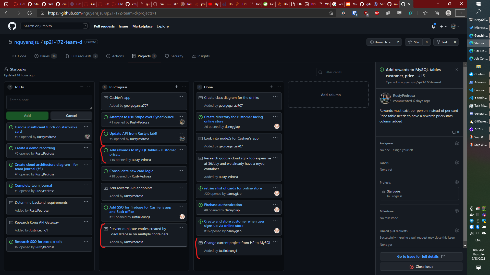
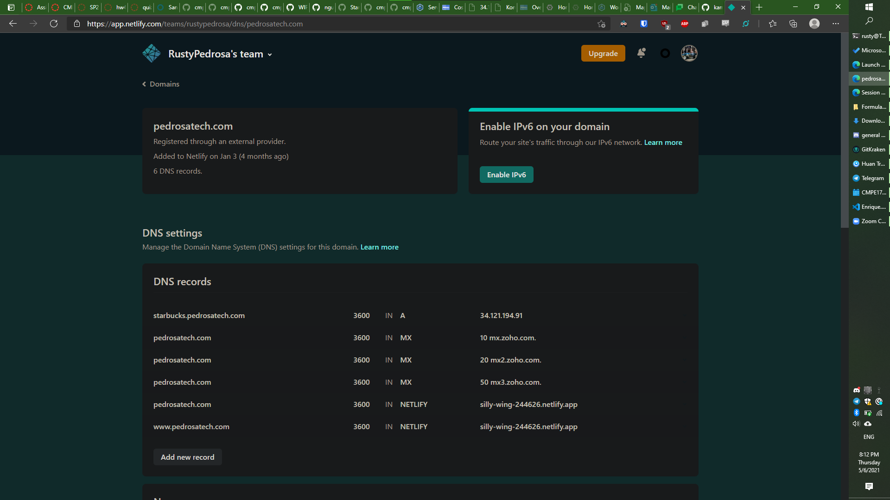
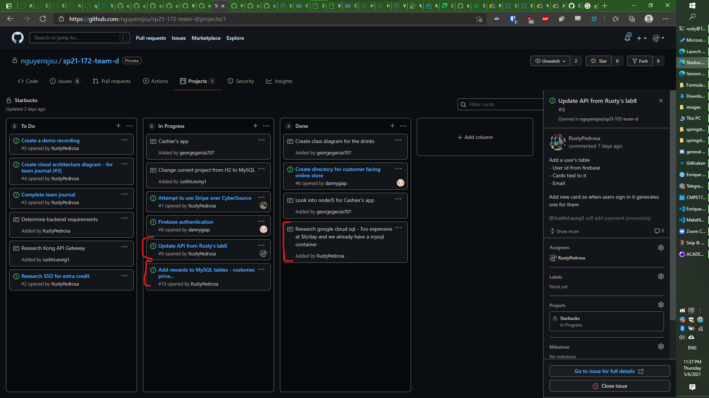

# CMPE 172 Project Journal - Rusty Pedrosa (Enrique)

## Week 4

- Finished testing my lab8 API merged with Justin's API
- Converted from H2 to MySQL
- Tested in local docker-compose
- Added rewards points to price table with defaults loaded by LoadDatabase
- Fixed an issue with duplicate prices being created in price table by multiple instances of api container

## Week 3
- Since I just finished lab 8, I want to see if I can keep it online and point a domain to my kong ingress IP for our project.
  - I already own a domain, pedrosatech.com, so let's see if I can get a subdomain going
  - The domain is registered through namecheap, but I just have it redirecting to some nsone DNS server.
  - Finally remembered that my DNS settings / webhosting are at Netlify now.. I set them up a while ago so I could have something at my domain.  It just points to a github repo without much content.

  - Turns out it is an easy process to change a GCP external IP to a static address - there's just a dropdown.

- Pulled my new api code (update from lab6 to lab8)
  - Working in branch user/epedrosa/lab8-api, based off of MySQLBranch
  - Updated folder structure to match team repo (package subfolders)
    - Tested API & made corrections (class scope, etc) so it still works
  - WIP: Still comparing changes vs mysqlbranch
- Abandoning CloudSQL, mainly because of price - I already had a GCP funding issue last week, and CloudSQL cost over $6 in a single day without even any apps attached to it.
- Created ticket #15 from the card for rewards.  Added more implemntation details 

## Week 2
- Started investigating Stripe as an alternative to CyberSource
  - Issue #1
  - Created an account at Stripe.  Looks like it will be similar to lab 7.
  - https://github.com/nguyensjsu/sp21-172-team-d/commit/f4b206bac10336f74abc280c45a545775cba40b6
- Reassigned stripe (issue #1) to Justin

- Created issue #2 for tracking SSO research
  - auth0
  - okta
  - firebase
  - onelogin
- Added tickets for the rest of the project requirements
- Started comparing API differences vs my lab6 submission

https://github.com/nguyensjsu/sp21-172-team-d/commit/f4b206bac10336f74abc280c45a545775cba40b6

## Week 1
- Missed our first group meeting due to a midterm timing conflict. Team brought me up to speed in group chat.
- Team already has laid out the first few tasks, so I will be getting started next week.
