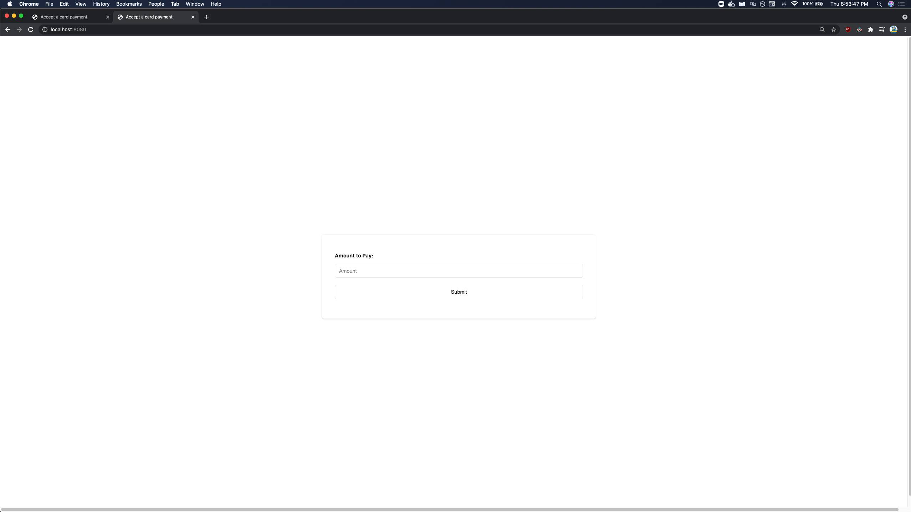
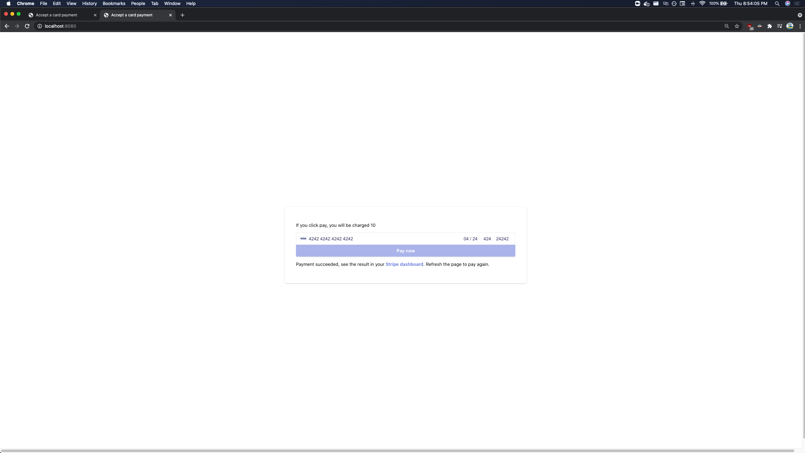
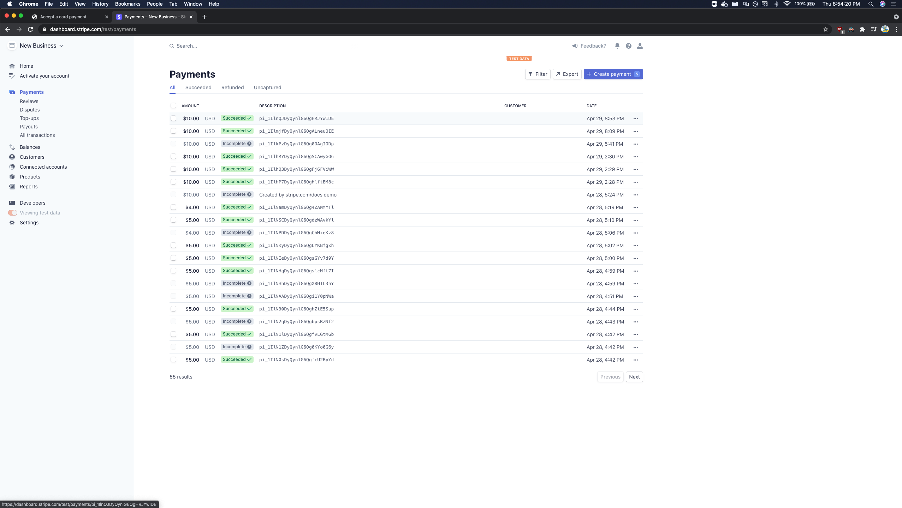
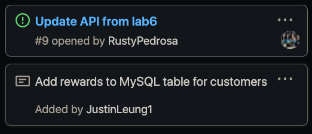

# CMPE 172 Project Journal
## Week 1
### Not much to report for me this week because I was busy studying for midterms. I led our first meeting and created the cards for our project so far. I will be on the backend team for our project. 

----

## Week 2

### We had a team meeting. I started working on implementing the Stripe API, I couldn't add it to our current directory because of issues with git as seen with my excessive amounts of commit
#### Shows amount the customer will pay

#### #### Checkout page that accepts cards

#### Stripe Dashboard

#### Card Worked on

-----

## Week 3

### For this week, I was working on implementing the many-to-one/one-to-many relationships between our starbucks cards and users. I also switched over our database from h2 to MySQL.

### I am into a lot of issues trying out to figure out my issues with the relational mapping. I used various resources including: Baeldung, Spring Documentation and looking at random github repositories to see how they implemented it. 

### Link To Last Commit
https://github.com/nguyensjsu/sp21-172-team-d/commit/a6622df247327fb46c5c1b848f93024a511b21d9 

## Cards Worked on
