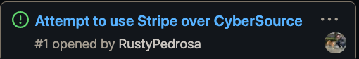

# CMPE 172 Project Journal
## Week 1
### Not much to report for me this week because I was busy studying for midterms. I led our first meeting and created the cards for our project so far. I will be on the backend team for our project. 

----

## Week 2

### We had a team meeting. I started working on implementing the Stripe API, I couldn't add it to our current directory because of issues with git as seen with my excessive amounts of commit
#### Shows amount the customer will pay

#### #### Checkout page that accepts cards

#### Stripe Dashboard

#### Card Worked on

-----
