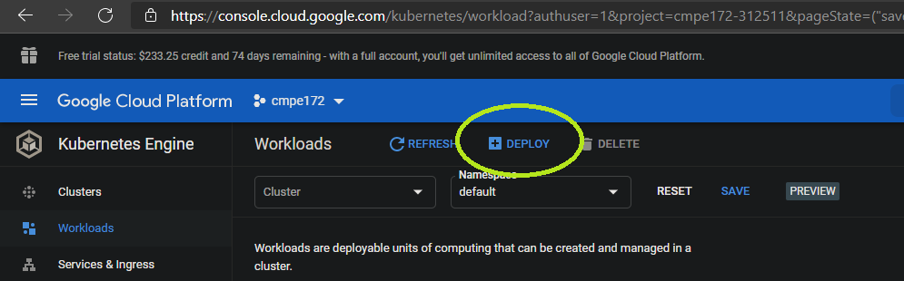

# Team D Journal (Team Project)

## Team Journals should include
- Overall Architecture Diagram of your Cloud Deployment


- A section for each of the following discussion the features implemented
  - Cashier's App
    - What features were implemented?
      - Cashier can select the type, size of the drink but also select if the customer wants to add a type of milk and/or add any toppings like whipped cream, drizzle, etc.
    - UI was based on the needs of a cashier when receiving an order and customize it based on what the customer wants.
    - Spring Boot was used to develop the cashier's app
  - Backoffice Help Desk App
    - What features were implemented?
  - Online Store
    - What features were implemented?
  - REST API 
    - Final design with sample request/response
  - Integrations
    - Which integrations were selected?
  - Cloud Deployments
    - Design Notes on GitHub an Architecture Diagram of the overall Deployment.
    - How does your Team's System Scale?  Can it handle > 1 Million Mobile Devices?
- Technical Requirements
  - Discussion with screenshot evidence of how each technical requirement is meet.

---

## Deployment to local docker (for development on your local machine)
A [Makefile](spring-starbucks-api/Makefile) is used to group together the commands used for launching various components of our app.
Our makefile has the following variables located at the top of the file:
```
account = rustypedrosa
app = spring-starbucks-api
network = starbucks-api-network
version-app = 2.0
version-docker = v2
```

In order to use the commands in the makefile, you need to `cd spring-starbucks-api`

---

### Create the docker network (only needed once)
The following command creates a docker network named `starbucks-api-network`
```
make create-network
```
Under the hood, this runs:
```
docker network create --driver bridge starbucks-api-network
```

---

### Create/launch mysql and starbucks-api containers
This command calls `docker-run-mysql` and `docker-run`
```
make docker-run-all
```

---

### Create/Launch mysql container only
When MySQL is launched, it also creates the database, root password, and user/password for the api
```
make docker-run-mysql
```
This runs:
```
	docker run -td --name starbucks-mysql --network $(network) -p 3306:3306 \
	-e MYSQL_DATABASE=db_starbucks \
	-e MYSQL_ROOT_PASSWORD=cmpe172 \
	-e MYSQL_USER=starbucks-user \
	-e MYSQL_PASSWORD=starbucks-password \
	mysql:8.0
```

---

### Launch api container only
Runs the API container and sets the MYSQL_HOST environment variable, which gets picked up by the API's application.properties.  Will crash/crashloop if the mysql container isn't running
```
make docker-run
```
This runs:
```
	docker run -td --name $(app) --network $(network) -p 8080:8080 \
	-e MYSQL_HOST=starbucks-mysql \
	$(app)
```

---

###  Delete containers
Run these as needed after making a change / before re-launching the commands above
Hint: You can generally leave the mysql container running and just clean/restart the API container
- Clean/delete all containers
```
make docker-clean-all
```
- Clean/delete starbucks-api container
```
make docker-clean
```
- Clean/delete mysql container
```
make docker-clean-mysql
```
- Clean/delete kong container  (not currently used)
```
make docker-clean-kong
```

---

## Google Cloud / Google Kubernetes Engine deployment
### 0. Preparation
You will need to create a project, and create a cluster within that project
### 1. Deployments
The first deployment we will create is for mysql.  The publicly available `mysql:8.0` container is sufficient, as long as we create it with the proper environment variables. 

---

#### mysql deployment
TODO: Create a mysql-deployment.yaml

For now, you can create a deployment manually via the cloud GUI with the deploy button



Enter `mysql:8.0` for the container image, and add environment variables as shown.
TODO: Figure out how to point the API deployment to the mysql config to pick up the user/password to the database


Click DONE (don't click ADD CONTAINER) when finished with the Container section.

In the Configuration section, give an application name (maybe something that says mysql in it) and make sure you are adding it to the right cluster.


Click DEPLOY when finished.

Note: the environment variables are stored/accessible from the `Configuration` tab of GKE instead of within the deployment's generated yaml file:


---

TODO: API deployment

Manual vs CI/CD

Services

Ingress

- ~~Copy mysql-deployment.yaml to cloud shell~~
- ~~kubectl create -f mysql-deployment.yaml~~
- `kubectl create -f service.yaml`
- `kubectl apply -f ingress-api-dep.yaml`
  - Note: the previous ingress api, ``, has been deprecated, but is currently still useable
  - The new api is `networking.k8s.io/v1`, which is more complicated to set up and is not currently working for app API endpoints.  If needed, an incomplete ingress yaml file is available in this repository at [ingress-api-dep.yaml](ingress-api-dep.yaml)
