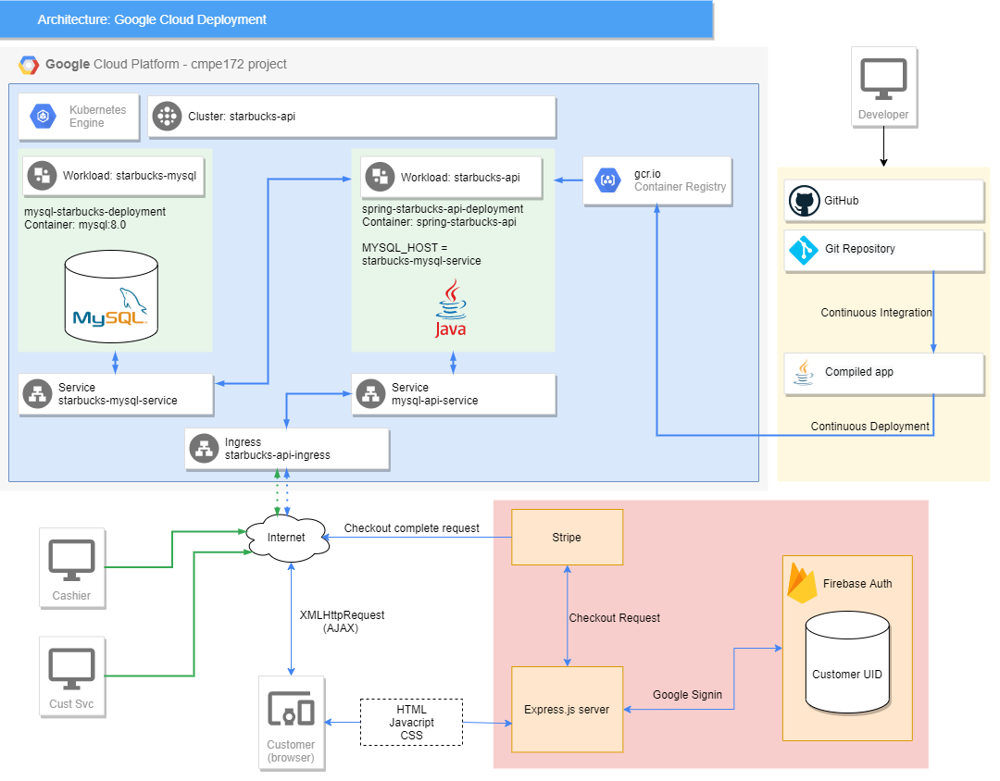
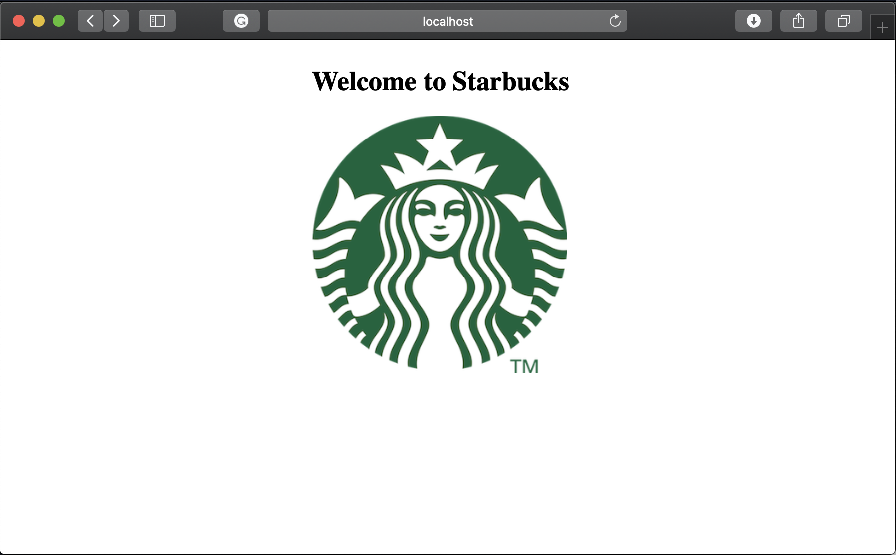
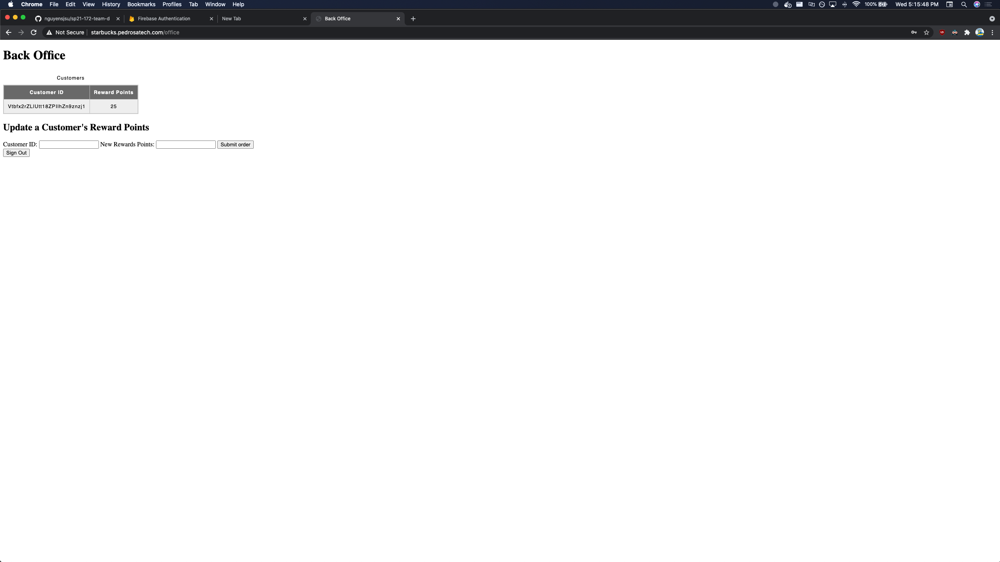
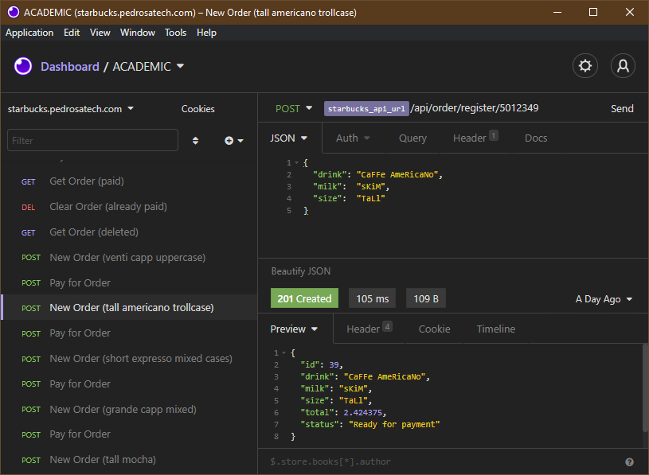
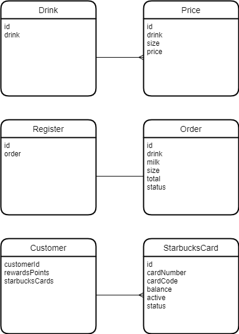
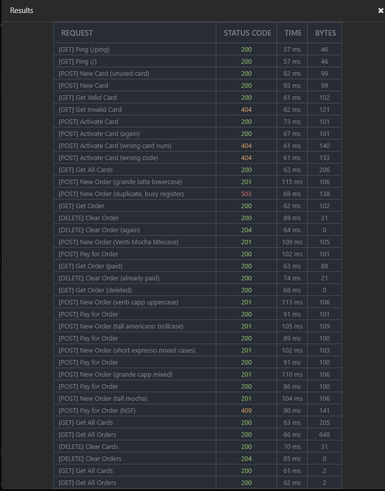
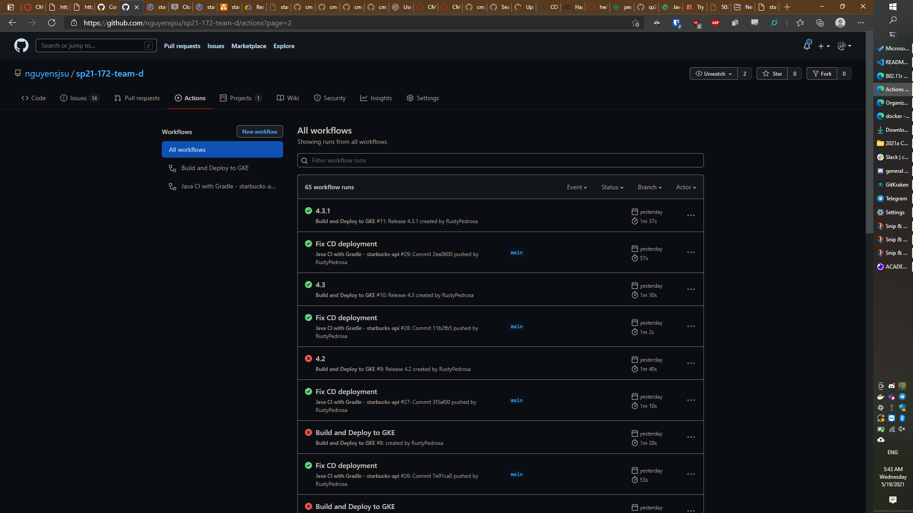

# Team D Journal (Team Project)

## Team Journals should include

- Overall Architecture Diagram of your Cloud Deployment
  

- **A section for each of the following discussion the features implemented - Discussion with screenshot evidence of how each technical requirement is met.** 100 Points Total

  - **Cashier's App using Spring Security for User Authentication**

    - What features were implemented?
      - Cashier can select the type, size of the drink but also select if the customer wants to add a type of milk and/or add any toppings like whipped cream, drizzle, etc.
    - UI was based on the needs of a cashier when receiving an order and customize it based on what the customer wants.
    - Spring Boot was used to develop the cashier's app

    - Cashier Homepage
      - starbucks logo is used as a hyperlink to map to next view
    
    

  - **Backoffice Help Desk App using Spring Security for User Authentication**
    - A back-office admin that is secured through Spring Security can see all customer's points.
    - The back-office admin can also set how many rewards points each customer has.
    - 

  - **SSO via OKTA or other providers is a "bonus" (i.e. Extra Credit - 10 points)**
    - We tried to tie in SSO through Google Firebase which would allow our users to sign in through multiple social media accounts and/or email/password.
    - While it does work with our online store, we were unable to get it to work with Spring Security for our Cashier's app and BackOffice. (Justin went to office hours and confirmed that this would still count for the extra credit)
    - https://firebase.google.com/docs/auth 


  - **Online Store Front (20 points)**

    - What features were implemented?
      - The online store allows customers to log in, view all their Starbucks cards, see their rewards, and load money into any of
        their cards.
    - Payment processing was implemented using Stripe. The payment page is loaded by routing the customer to Stripe's checkout page. Upon success, an event will be forwarded to an endpoint in our Starbucks API that updates the database with a new card balance.

  - **REST API (20 points)** - Final design with sample request/response - For the purposes of this class, the API is exposed to the internet. Sample URLs: - http://starbucks.pedrosatech.com/api/cards - http://starbucks.pedrosatech.com/api/orders - This sample request/response with a tRoLl CaSe is indicative of our use of Spring JPA Repository features to create a robust backend, using method names such as `findByDrinkIgnoreCaseAndSizeIgnoreCase` to allow for a dynamically generated database search in which both of the query predicates are case-insensitive
     - Our API was carried over from the labs of two team members, merged together and expanded. It includes tables/classes for `Customer`, `Drink`, `Order`, `Price` and `Register` in order to move business information out of application memory and into provide persistent storage in our database.
     - The API was tested via Insomnia. - Our insomnia project is at [insomnia_starbucks-api.json](insomnia_starbucks-api.json) - Please select the starbucks.pedrosatech.com environment - We used `insomnia-plugin-default-headers` to allow us to run the entire suite of tests in one click
     - We used `insomnia-plugin-default-headers` to allow us to dynamically insert the Kong API secret into every request's header
    

  - **Kong API Gateway or other API authentication gateway is a "bonus" (i.e. Extra Credit = 10 points)**

    - While we had a working Kong implementation, we had to remove it and switch to a standard GKE ingress because of some CORS issues which prevented external services from connecting to our API.
    - Unfortunately, no screenshots were taken before the entire GKE cluster with our Kong implementation was deleted. The only evidence we have left of it running on GKE is a single commit with our Kong yaml file. Hopefully it is worth a point or two of extra credit.
      - https://github.com/nguyensjsu/sp21-172-team-d/commit/7332b137c4a345332d93cd3b9359f0e3040d2f85
    - Our [docker-compose.yaml](docker-compose.yaml) file does have Kong working, but the frontend team had issues with Kong running in local docker as well.
    - **Can someone please add a discussion of what CORS is and what problems you had with Kong running?**

  - **Integrations (Payment API) (20 points)**

    - Which integrations were selected?
      - Stripe

  - **CI/CD (extra credit?)**

    - Continuous integration was relatively easy to implement
      - It took some sleuthing to figure out that we can add a default working directory. This was needed because our API is inside of a subfolder instead of a root. Simply adding a tep to `cd` into a path isn't sufficient, because every step is run separately
        ```
        defaults:
          run:
            working-directory: ./spring-starbucks-api
        ```
    - Continuous deployment took a lot of figuring out. After tearing apart most of the GKE deployment, it turns out there is a GKE ingress feature that marks the backend as unhealthy if it doesn't give a 200 response on `/`. In other words, the CI itself was just fine, and we were just deploying code that GKE thought was invalid. The fix was to simply point `/` to something.
    - The CI configuration file is [.github\workflows\gradle.yml](.github\workflows\gradle.yml)
    - The CD configuration file is [.github\workflows\google.yml](.github\workflows\google.yml)
    - The build and deployment history can be seen at: https://github.com/nguyensjsu/sp21-172-team-d/actions
      

  - **Cloud Deployment (20 points)**
    - Please see the section below titled _Deployment to Google Cloud_
    - **How does your Team's System Scale? Can it handle > 1 Million Mobile Devices?**
      - While our front end is scalable via automatic horizontal scaling as provided by GKE, some basic enhancements to guarantee unique keys to prevent collisions might be in order.
      - Currently, our deployment uses an ephemeral MySQL container with no persistent storage. We abandoned our deployment to Cloud SQL due to cost (almost $10/day just for the VM, which even at the minimum tier still receives dedicated hardware).
        - We did, however, spin up a Cloud SQL MySQL server instance. Our API would connect to it using the Cloud SQL sidecar container. The sidecar container is a proxy server that actually runs within the API container. This enables our API to connect via the Cloud SQL Auth proxy, which simply looks like a MySQL server at localhost. It took a tremendous amount of time to set up all the moving parts. https://cloud.google.com/sql/docs/mysql/connect-kubernetes-engine

---

## Deployment to local docker (for development on your local machine)

A [Makefile](spring-starbucks-api/Makefile) is used to group together the commands used for launching various components of our app.
Our makefile has the following variables located at the top of the file:

```
account = rustypedrosa
app = spring-starbucks-api
network = starbucks-api-network
version-app = 2.0
version-docker = v2
```

In order to use the commands in the makefile, you need to `cd spring-starbucks-api`

---

### Create the docker network (only needed once)

The following command creates a docker network named `starbucks-api-network`

```
make create-network
```

Under the hood, this runs:

```
docker network create --driver bridge starbucks-api-network
```

---

### Create/launch mysql and starbucks-api containers

This command calls `docker-run-mysql` and `docker-run`

```
make docker-run-all
```

---

### Create/Launch mysql container only

When MySQL is launched, it also creates the database, root password, and user/password for the api

```
make docker-run-mysql
```

This runs:

```
	docker run -td --name starbucks-mysql --network $(network) -p 3306:3306 \
	-e MYSQL_DATABASE=db_starbucks \
	-e MYSQL_ROOT_PASSWORD=cmpe172 \
	-e MYSQL_USER=starbucks-user \
	-e MYSQL_PASSWORD=starbucks-password \
	mysql:8.0
```

---

### Launch api container only

Runs the API container and sets the MYSQL_HOST environment variable, which gets picked up by the API's `application.properties`. Will crash/crashloop if the mysql container isn't running

```
make docker-run
```

This runs:

```
	docker run -td --name $(app) --network $(network) -p 8080:8080 \
	-e MYSQL_HOST=starbucks-mysql \
	$(app)
```

---

### Delete containers

Run these as needed after making a change / before re-launching the commands above
Hint: You can generally leave the mysql container running and just clean/restart the API container

- Clean/delete all containers

```
make docker-clean-all
```

- Clean/delete starbucks-api container

```
make docker-clean
```

- Clean/delete mysql container

```
make docker-clean-mysql
```

- Clean/delete kong container (not currently used)

```
make docker-clean-kong
```

---

## Deployment to Google Cloud (Google Kubernetes Engine)

### 0. Preparation

You will need to create a project, and create a cluster within that project

### 1. Deployments

The first deployment we will create is for mysql. The publicly available `mysql:8.0` container is sufficient, as long as we create it with the proper environment variables.

---

#### MySQL Deployment

TODO: Create a mysql-deployment.yaml

We use a standard mysql container with no special configuration beyond the use of environment variables. For now, you can create a deployment manually via the cloud GUI with the deploy button.


Enter `mysql:8.0` for the container image, and add environment variables as shown.
TODO: Figure out how to point the API deployment to the mysql config to pick up the user/password to the database


Click DONE (don't click ADD CONTAINER) when finished with the Container section.

In the Configuration section, give an application name (maybe something that says mysql in it) and make sure you are adding it to the right cluster.


Click DEPLOY when finished.

Note: the environment variables are stored/accessible from the `Configuration` tab of GKE instead of within the deployment's generated yaml file:


---

#### Starbucks API deployment

CI/CD of our application API is handled by a pair of GitHub actions.

- Continuous integration is run whenever a new commit is pushed to main or a PR against main is opened.
  - The CI configuration file is [.github\workflows\gradle.yml](.github\workflows\gradle.yml)
- Continuous deployment is triggered by the creation of a new GitHub Release.
  - The CD configuration file is [.github\workflows\google.yml](.github\workflows\google.yml)

To push new code to Google Cloud Platform, simply merge your pull request into main. You can watch the build and deployment processes here:
https://github.com/nguyensjsu/sp21-172-team-d/actions

---

### 3. Services

GKE services allow containers to connect to each other. For now, the MySQL service must be created manually. The API service is created automatically by our CI/CD process.


- The MySQL deployment needs a service to expose port 3306 to the rest of GKE
- The API deployment needs a service to expose port 8080 for the ingress

---

#### MySQL Service

Comment: The MySQL service must be up in order for the API to be able to connect to the database. Instead of using a container name as the hostname, the API needs to point to the service name, `starbucks-mysql-service`.

To create the service, upload service-mysql.yaml to your cloud shell and run:

```
kubectl create -f service-mysql.yaml
```

---

#### API Service

The API service is created automatically by our CI/CD process. The configuration file for the service is located at [service.yaml](service.yaml).

If you need to create the service manually, it can open port 8080 without redirecting it, and it should point to the api deployment.

```
kubectl create -f service.yaml
```

---

#### Ingress

- Kong API
  - Unfortunately, due to difficulties with CORS and some of our external services, we have had to tear down our Kong ingress.
  - For the time being, we have implemented a standard GKE ingress.


To deploy the standard ingress, upload [ingress-api-v1beta1.yaml](ingress-api-v1beta1.yaml) to your cloud shell and run

```
kubectl apply -f ingress-api-v1beta1.yaml
```

Note: Currently, we are using the v1beta1 ingress API, which has been deprecated as of May 2021. The new api is `networking.k8s.io/v1`, which is more complicated to set up and is not currently working for app API endpoints. If needed, an incomplete ingress yaml file with the new API is available in this repository at [ingress-api-k8s.yaml](ingress-api-k8s.yaml)

Comment: Some groups have had trouble with their ingress reporting backend services as unknown or unhealthy:

()[]

There are three fixes for this, detailed at: https://stackoverflow.com/questions/39294305/kubernetes-unhealthy-ingress-backend/39297106#39297106

We have chosen to simply route `/` so that it returns a 200 response.


